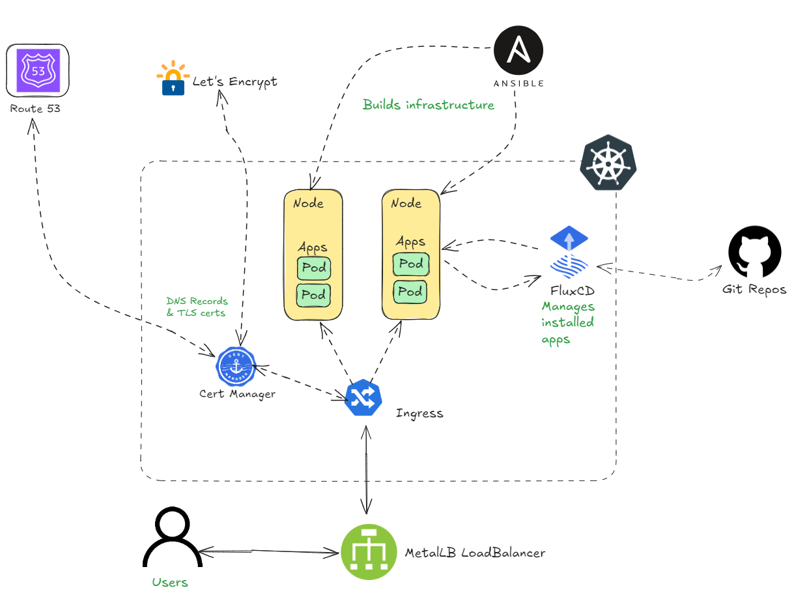

# :house: Homelab Infrastructure

This repository contains the documentation, configuration and scripts for my homelab. It is the source of truth for everything in my lab.

## Purpose

The purpose of this homelab is to learn and have fun in an environment I have full control over. As a DevOps Engineer, I have to keep my technical skills sharp and relevant to industry best practices. This homelab gives me the opportunity to experiment with new technologies, frameworks and tools without any risk to client systems. Managing my own infrastructure forces me to think about best practices around security, deployments, backups and maintenence. The best part is that I get to learn things by doing. I'll also use it to self-host personal projects and applications I need.

## Principles

I have a few principles guiding my approach to building this homelab:

- I use hardware that is power efficient where possible.
- I'm currently AWS-focused so I try to leverage AWS solutions where possible in the cluster. For example, I use AWS Route 53 to manage DNS and AWS Parameter Store to store secrets.
- When deploying self-hosted tools, I opt for free or open source ones that give me full control of my data.
- Everything in the cluster is deployed through Infrastructure as Code or GitOps.
- I aim to adopt best practices in deployment and security.

## Cluster Set Up

My homelab has two Kubernetes clusters; a staging cluster made up of virtual machines and a production cluster that runs on physical hardware.
I use power-efficient and low cost devices like laptops and Raspberry Pis whenever possible. All servers run on Ubuntu Linux and I use K3s, a lightweight version of Kubernetes that is designed to run on low-resource environments.

### Hardware

The production cluster runs on physical hardware:

- **Control Node**: HP 635 Probook 8GB of Ram, 500GB HDD, dual core AMD CPU
- **Worker Node 1**: Apple Mac Mini(2009), 2GB RAM, dual core Intel CPU

### Staging

The staging cluster runs on Ubuntu VMs in a Hyper-V Host

## Secrets

Passwords, secrets and API keys are stored in AWS Systems Manager Parameter Store.

## Repo Structure

I'm working on following the Flux CD recommended directory structure, I'm not entirely there but close to it. Cluster configuration is in the `clusters` directory that contains YAML files for both the `staging` and `production` clusters. Any code pushed to these directories is automatically deployed and applied by Flux CD to the respective cluster.

Each of the cluster directories has a number of sub-directories:

- `apps` contains configuration for all applications deployed to the cluster. Each application has its own directory containing the necessary manifests and configurations.
- `flux-system` as the name suggests, contains configuration for the FluxCD tool. FluxCD is used to manage GitOps workflow for the clusters.
- `infrastructure` contains cluster-wide configurations for infrastructure components such as AWS, cert-manager, external-secrets, Load Balancers, Ingress controllers, TLS certificate tools and other infrastructure tools.

I used Ansible to provision each of the servers. The playbooks to provision the server are [located here]().
